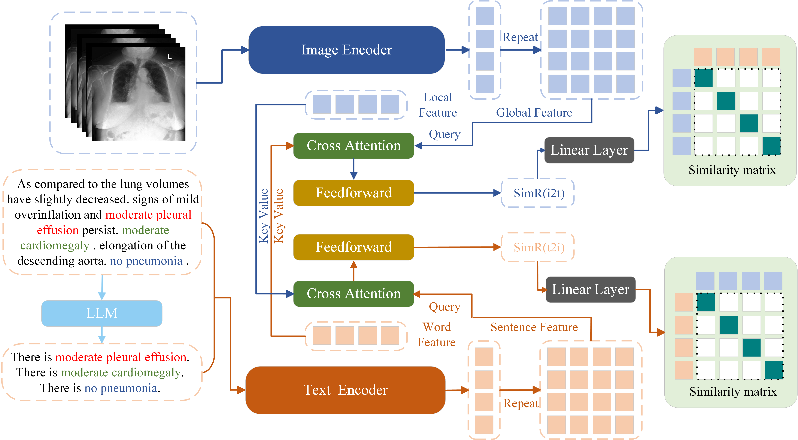

# CARZero: Cross-Attention Alignment for Radiology Zero-Shot Classification

CARZero (**C**ross-attention **A**lignment for **R**adiology **Zero**-Shot Classification) is a pioneering multimodal representation learning framework designed for enhancing medical image recognition with minimal labeling effort. It leverages the power of cross-attention mechanisms to intelligently align disparate data modalities, facilitating label-efficient learning and accurate classification in the medical imaging domain.

>**[CARZero Manuscript](http://arxiv.org/abs/2402.17417)** \
> Haoran Lai, Qingsong Yao, Zihang Jiang. Rongsheng Wang, Zhiyang He, Xiaodong Tao, S. Kevin Zhou <br> 
> University of Science and Technology of China <br>
> IEEE Conference on Computer Vision and Pattern Recognition (CVPR), 2024 <br>

## Approach



## Dataset Overview

### Training Data
- **MIMIC-CXR**: [PhysioNet](https://physionet.org/content/mimic-cxr/1.0.0/) - Contains 377,110 images from 227,835 radiographic studies of 65,379 patients.

### Inference Data
- **Open-I**: [Open-I's FAQ page](https://openi.nlm.nih.gov/faq) - Features 3,851 reports and 7,470 chest X-ray images, annotated for 18 multi-label diseases.
- **PadChest**: [BIMCV](https://bimcv.cipf.es/bimcv-projects/padchest/) - Includes 160,868 chest X-ray images of 192 different diseases, with 27% manually annotated.
- **ChestXray14**: [NIH's Box storage](https://nihcc.app.box.com/v/ChestXray-NIHCC/folder/37178474737) - Comprises 112,120 images with 14 disease labels from 30,805 patients.
- **CheXpert**: [Stanford ML Group](https://stanfordmlgroup.github.io/competitions/chexpert/) - Consists of 224,316 chest X-rays from 65,240 patients, with a consensus-annotated test set of 500 patients.
- **ChestXDet10**: [GitHub](https://github.com/Deepwise-AILab/ChestX-Det10-Dataset) - A subset of NIH ChestXray14, containing 3,543 images with box-level annotations for 10 diseases.

### Data Pre-processing
File names are saved in the `Dataset` folder, which can be dowload in [here](https://drive.google.com/drive/folders/1Oubkx6ZQqmK5bTwVXhReHDyhz3Ms1vzF?usp=drive_link) Please update the PATH in the filename list to your image storage location for integration.

## Pretraining Model

For the image encoder, Vit/B-16 is utilized, pre-trained using [MAE](https://github.com/RL4M/MRM-pytorch) and [M3AE](https://github.com/zhjohnchan/M3AE) techniques. Our pre-trained models are available [here](https://drive.google.com/file/d/1QJvtatLuIlYqi-V1DjgHnACM2kq2C-ET/view?usp=sharing) for download in the `./pretrain_model` folder.

For text encoding, BioBert is fine-tuned on MIMIC and Padchest reports and available through Hugging Face:

```python
from transformers import AutoModel, AutoTokenizer

tokenizer = AutoTokenizer.from_pretrained("Laihaoran/BioClinicalMPBERT")
model = AutoModel.from_pretrained("Laihaoran/BioClinicalMPBERT")
```


## Getting Started

Start by [installing PyTorch 1.12.1](https://pytorch.org/get-started/locally/) with the right CUDA version, then clone this repository and install the dependencies.  

```bash
$ conda install pytorch==1.12.1 torchvision==0.13.1 torchaudio==0.12.1 cudatoolkit=11.3 -c pytorch
$ pip install git@github.com:laihaoran/CARZero.git
$ conda env create -f environment.yml
```


### Zeroshot classification for mutil-label datasets (OpenI PadChest ChestXray14 CheXpert ChestXDet10)

If you want to test the performance of our model, you can dowload the trained [CARZero](https://drive.google.com/file/d/1kYF-k5otW5DHwz1En5d_ScV3zu2E27Ch/view?usp=sharing) and place is in the `./pretrain_model` folder. Run the script file for test.

```bash
sh test.sh
```

## Training

Example configurations for pretraining can be found in the `./configs`. All training are done using the `run.py` script. Run the script file for training: 

```bash 
sh train.sh
```

**Note:** The batch size increases sequentially from 64, to 128, and finally to 256. It is advisable to remember this progression and utilize a GPU equipped with 80 GB of memory to accommodate these changes efficiently.


### Citation

```
@inproceedings{lai2024carzero,
  title={Carzero: Cross-attention alignment for radiology zero-shot classification},
  author={Lai, Haoran and Yao, Qingsong and Jiang, Zihang and Wang, Rongsheng and He, Zhiyang and Tao, Xiaodong and Zhou, S Kevin},
  booktitle={Proceedings of the IEEE/CVF Conference on Computer Vision and Pattern Recognition},
  pages={11137--11146},
  year={2024}
}
```

#### Acknowledgements

Our sincere thanks to the contributors of [MAE](https://github.com/RL4M/MRM-pytorch), [M3AE](https://github.com/zhjohnchan/M3AE), and [BERT](https://github.com/dhlee347/pytorchic-bert) for their foundational work, which greatly facilitated the development of CARZero.
